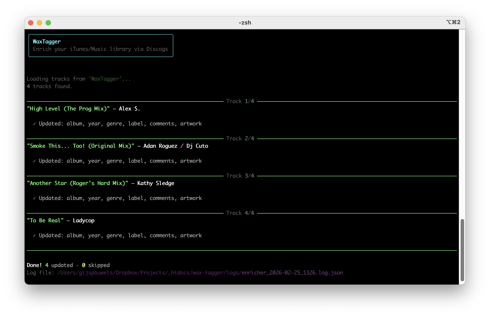
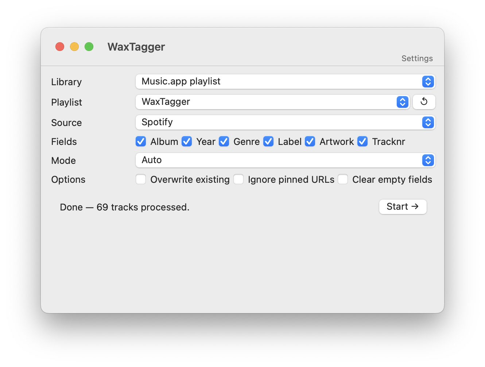
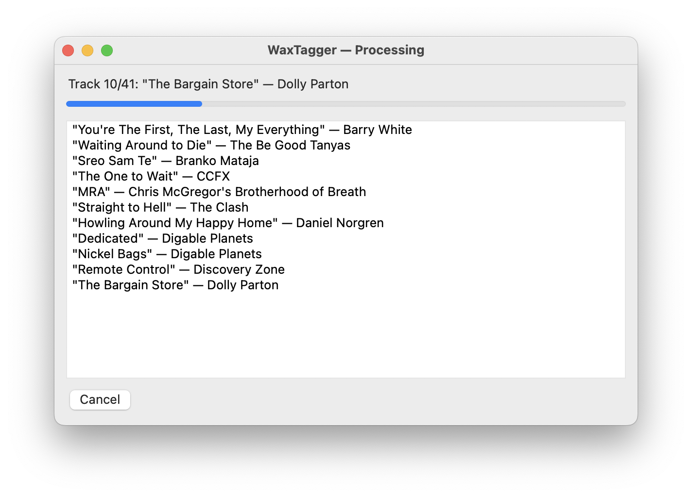
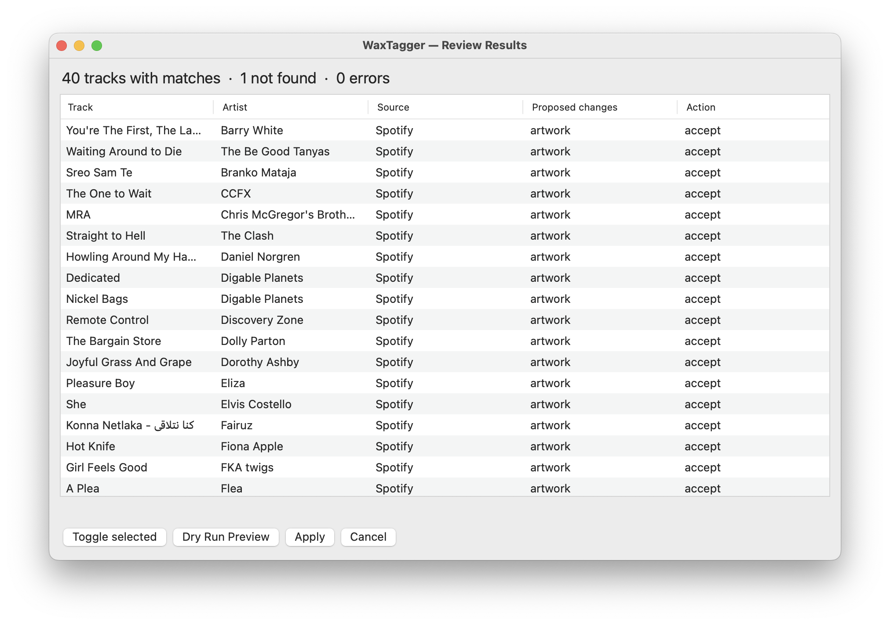

# WaxTagger

Enriches your music with metadata from [Discogs](https://www.discogs.com) or [Spotify](https://open.spotify.com): album, year, genre, label, artwork, track number and release URL. Reads tracks from an Apple Music playlist **or a folder of audio files on disk**.

You can use it three ways, all built on the same engine:

| | Best for |
|---|---|
| **Interactive terminal (TUI)** | Going through a playlist track by track and picking the right release yourself |
| **CLI with flags** | Scripted / unattended runs (`-p "House" -s discogs -m auto -f all`) |
| **macOS app (GUI)** | Run a batch, then review and accept/skip per track — early stage, see below |



## Requirements

- macOS (Apple Music/iTunes for playlist mode; folder mode only needs the files)
- Python 3.11+
- [ffmpeg](https://ffmpeg.org) (for MP3s with corrupt ID3 headers): `brew install ffmpeg`
- A free Discogs account with a registered app (see below), and/or a Spotify Developer app

## Installation

```bash
git clone https://github.com/gijspouwels/wax-tagger.git
cd wax-tagger
python3 -m venv .venv
.venv/bin/pip install -r requirements.txt
```

## Credentials

WaxTagger needs API credentials for Discogs and/or Spotify (both free). They are looked up in this order:

1. **App settings** — `~/Library/Application Support/WaxTagger/.env`, written by the app's *Settings* screen
2. **Project `.env`** — in the checkout, for when you run the CLI or build the app yourself
3. Environment variables

Using the app? Open **Settings**, click *Get credentials…* next to Discogs/Spotify, paste the keys and hit *Save*. On the first run without any credentials the Settings screen opens by itself. Using the CLI? Put them in a `.env` in the project folder. The app shows next to each field where its current value comes from, and a field left empty falls back to the project `.env` / environment.

## Configuring Discogs

1. Go to [discogs.com/settings/developers](https://www.discogs.com/settings/developers)
2. Click **Create an application**
3. Fill in a name (e.g. "WaxTagger") and save
4. Copy the **Consumer Key** and **Consumer Secret**
5. Paste them in the app's Settings screen, or create a `.env` file in the project folder:

```
DISCOGS_CONSUMER_KEY=your_consumer_key
DISCOGS_CONSUMER_SECRET=your_consumer_secret
```

Discogs also needs a one-time OAuth authorization: click *Authorize with Discogs* in Settings (the CLI does this automatically on first run). A browser opens; enter the verifier code shown by Discogs. The access token is saved in `.oauth_tokens` and won't need to be entered again.

## Configuring Spotify

1. Go to [developer.spotify.com/dashboard](https://developer.spotify.com/dashboard)
2. Log in with your Spotify account and click **Create app**
3. Fill in a name and description; you can use `http://localhost` as the Redirect URI
4. Open the app and go to **Settings** → copy the **Client ID** and **Client Secret**
5. Paste them in the app's Settings screen (*Test connection* verifies them), or add them to your `.env` file:

```
SPOTIFY_CLIENT_ID=your_client_id
SPOTIFY_CLIENT_SECRET=your_client_secret
```

> **Note:** WaxTagger uses the *Client Credentials Flow* — no browser login or user account is required. Only the app credentials are needed.

**Limitations compared to Discogs:**
- Genres come from the artist level (Spotify rarely has genres at the album level); can be broad
- Style tags are absent (Discogs-specific)
- Artwork is capped at ~300px (intentional choice for file size)

## Usage

### Interactive terminal (TUI)

```bash
.venv/bin/python3 main.py
```

Without flags WaxTagger asks for everything step by step and lets you choose between candidate releases per track.

#### Step by step

**1. Choose a playlist**

```
Available playlists:
   1   House (976)
   2   Hip Hop (349)
   3   Disco (178)
   ...
Choose playlist (number) [1]: 2
```

**2. Choose a metadata source**

| Source | Strong at |
|---|---|
| Discogs | Vinyl collections, detailed genre/style tags, label information |
| Spotify | Popular releases, broad artist coverage |

If the primary source finds nothing, the other source is automatically tried as a fallback.

**3. Choose a mode**

| Mode | Behavior |
|---|---|
| Interactive | Show candidates per track, choose yourself |
| Automatic | Pick the best match directly |
| Dry run | Show what would be changed, writes nothing |

**4. Overwrite existing metadata?**

- **No** (default): fill in only empty fields
- **Yes**: overwrite already-filled fields as well

#### Choosing a release

Per track you see the found releases:

```
Track 14/47: "Get-A-Way" — Maxx
Current: album: Get-A-Way · year: 1993

  1  ★ Get-A-Way (1993) · Blow Up · Electronic, Euro House
  2    Get-A-Way (1993) · Blow Up · Electronic, Eurodance
  3    Get-A-Way (1994) · Pulse-8 Records · Electronic, Euro House

Choice (1/2/3 / s=skip / q=quit): 1
✓ Updated: album, year, genre, label, comments, artwork
```

### CLI flags

All choices can also be passed as flags to skip interactive prompts:

| Flag | Description | Example |
|---|---|---|
| `-p`, `--playlist` | Playlist name or number | `-p "House"` or `-p 5` |
| `-d`, `--folder` | Read tracks from a folder on disk instead of a playlist | `-d ~/Music/Incoming` |
| `--no-recursive` | With `--folder`: do not scan subfolders | `--no-recursive` |
| `--rename [PATTERN]` | With `--folder`: rename files from the enriched tags (default `{artist} - {title}`) | `--rename "{tracknr} {artist} - {title}"` |
| `-s`, `--source` | Primary source: `discogs` (default) or `spotify` | `-s spotify` |
| `-f`, `--fields` | Fields to enrich (comma-separated numbers or names), or `all` | `-f "1,2,3"` or `-f "album,year"` or `-f all` |
| `-m`, `--mode` | Mode: `interactive`, `auto`, or `dry` | `-m auto` |
| `-o`, `--overwrite` | Overwrite existing metadata (flag, no value) | `-o` |
| `--ignore-pinned` | Ignore pinned URL in comments, search instead | `--ignore-pinned` |
| `--clear-empty` | Clear fields when the search result has no value for them | `--clear-empty` |

Without `-f`, you will be asked interactively which fields to enrich. Unspecified options are asked interactively.

**Examples:**

```bash
# Discogs, fully automatic, all fields, no overwrite
.venv/bin/python3 main.py -p "Playlist Name" -s discogs -m auto -f all

# Discogs, all fields, including overwriting existing metadata
.venv/bin/python3 main.py -p "Playlist Name" -s discogs -m auto -f all -o

# Spotify as primary source, dry run
.venv/bin/python3 main.py -p House -s spotify -m dry

# Update only album and year, interactive
.venv/bin/python3 main.py -p 5 -f "1,2"

# Folder on disk, Spotify, and rename files to "Artist - Title.ext"
.venv/bin/python3 main.py -d ~/Music/Incoming -s spotify -m auto -f all --rename
```

### macOS app (GUI)

> The GUI is still early-stage: it covers the full batch → review → apply flow and credential setup, but expect rough edges.



1. **Library** — a Music.app playlist, or a folder on disk (with optional file renaming, e.g. `{artist} - {title}`)
2. **Source** — Discogs or Spotify as primary source; the other one is tried as a fallback
3. **Fields** — which fields to enrich
4. **Mode** — *Auto* picks the best match per track; *Dry run* only shows what would change
5. **Options** — overwrite existing values, ignore pinned URLs, clear fields that have no value in the match





The review screen lists every track with its source and the proposed changes. Toggle rows to skip them, check with *Dry Run Preview*, then *Apply*. Nothing is written before that. Tracks whose title still contains `Artist - Title` (with an empty artist field) are split automatically and the cleaned artist/title are proposed as changes too.

#### Building the app

```bash
pip install briefcase
briefcase build macOS app        # → build/waxtagger/macos/app/WaxTagger.app
```

The packaged app keeps its files in `~/Library/Application Support/WaxTagger/` (`.env` from Settings, `.oauth_tokens`, `logs/`). When you build from a checkout that has a project `.env`, those credentials are used as fallback, so you don't have to enter them twice.

### Folder mode

With `-d/--folder` (or *Folder on disk* in the GUI) WaxTagger scans MP3, M4A/AAC, FLAC, AIFF and WAV files and reads/writes their tags directly. If a file has no artist tag, artist and title are guessed from the title tag or the filename (`Artist - Title.ext`; a leading track number is ignored).

Rename variables: `{artist} {title} {album} {year} {genre} {label} {tracknr}`. Empty variables and dangling separators are dropped; illegal characters are replaced; name clashes get ` (2)`, ` (3)`, …

### URL pinning

If a track has a Discogs or Spotify URL in its comments, that release is used directly without searching:

```
# Discogs release:  https://www.discogs.com/release/12345
# Discogs master:   https://www.discogs.com/master/6789
# Spotify album:    https://open.spotify.com/album/37i9dQZF...
# Spotify track:    https://open.spotify.com/track/4iV5W9...
```

When a URL is pinned, the corresponding client is always used regardless of the selected `--source`.

### No match found

- **Overwrite = No**: track is skipped
- **Overwrite = Yes**: genre, label (grouping), and comments are cleared

## Written fields

| Field | Source | Music.app | File tag (folder mode) |
|---|---|---|---|
| Album | Release title | Album | `TALB` / `©alb` / `ALBUM` |
| Year | Release year | Year | `TDRC` / `©day` / `DATE` |
| Genre | Genres + styles (Discogs) / artist genres (Spotify) | Genre | `TCON` / `©gen` / `GENRE` |
| Label | Label | Grouping **and** `TPUB` in the file | `TPUB` (MP3/WAV/AIFF), `ORGANIZATION` (FLAC) |
| Comments | Release URL (Discogs or Spotify) | Comments | `COMM` / `©cmt` / `COMMENT` |
| Artwork | Cover art | written into the file, then `refresh` | MP3/M4A/FLAC/WAV/AIFF |
| Track number | Position on album (X/Y) | Track number | `TRCK` / `trkn` / `TRACKNUMBER` — Spotify only |
| Artist / Title | Split from `Artist - Title` when the artist field is empty | Artist / Name | `TPE1` / `TIT2` etc. |

The **Label** is written both to Music.app (Grouping) and into the audio file as `TPUB`, so Rekordbox reads it as Label.

## Log file

After each session a JSON log file is created in `logs/` (project folder for the CLI/TUI; `~/Library/Application Support/WaxTagger/logs/` for the app) with the status and changes applied per track. Useful if you want to undo something.

## Search strategy

The search function automatically tries multiple variants when an initial query returns no results. Strategies are tried one by one; the first with results wins.

**Title processing:**
- Version suffixes are stripped: `(Original Mix)`, `(Extended)`, `(Radio Edit)`, `(Bart Claessen Remix)`, etc.
- The last parenthesized group is dropped as an extra fallback, even if not recognized as a standard suffix (e.g. `(M&S Extended Vocal)`)
- The first 2 words from parentheses are used as an extra search term (e.g. `Bart Claessen` from `(Bart Claessen Remix)`)
- Editor/mixer name is tried as the artist (e.g. `Underdog` from `(Underdog Edit)`)

**Artist normalization:**
- Hyphens and underscores are replaced by spaces
- `feat.` / `ft.` / `featuring` / `presents` are stripped
- Comma-collaborators are dropped (e.g. `Orbital` from `Orbital, Penelope Isles`)
- Leading prefixes `The`, `DJ`, `MC` are stripped
- As a last resort, only the first word of the artist name is used

**Fallback to other source:** if the chosen source (Discogs or Spotify) finds nothing, the other source is tried automatically.

## Project structure

```
wax-tagger/
├── main.py                    # CLI/TUI entry point (thin shim around src/waxtagger)
├── pyproject.toml             # Briefcase app config
├── requirements.txt
├── docs/                      # Screenshots
├── src/waxtagger/
│   ├── app.py                 # Toga app: startup, toolbar
│   ├── screens/               # GUI screens: main, progress, review, settings
│   ├── enricher.py            # Core: batch run, matching, proposed changes, writing
│   ├── config.py              # Credentials (app settings → project .env → env) and paths
│   ├── track.py               # Shared Track model (both library sources)
│   ├── models.py              # Shared Release model (Discogs + Spotify)
│   ├── utils.py               # artist_match, title_match, split_artist_title
│   ├── itunes/bridge.py       # Music.app via AppleScript + file tags via mutagen
│   ├── folder/bridge.py       # Folder source: scan, read/write tags, rename
│   ├── discogs/client.py      # Discogs API (OAuth, search, artwork)
│   └── spotify/client.py      # Spotify API (client credentials, search, artwork)
├── .env                       # Local credentials (not in git)
└── .oauth_tokens              # Discogs access token (auto-created, not in git)
```
